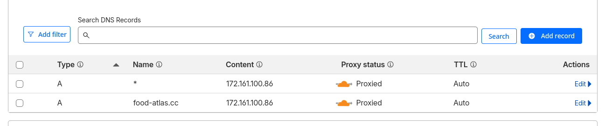

## VPS

First, procure yourselft a vps.
We use azure but any that provides a static ip and ssh access out of the box can work.
Choose a deb based system, for best compatibility, use Ubuntu 24.

### Restrict ssh to key only

If your VPS is not by default set to ssh key only authentication, do the following (on your local system):

```
# If you need an ssh key
ssh-keygen -t ed25519 -f id_myvps

# Add the public key to the authorized_keys file
cat id_myvps.pub | ssh ubuntu@<vm public ip> "cat >> ~/.ssh/authorized_keys"
```

Then, on the machine:

```
# Change config
sudo tee /etc/ssh/sshd_config.d/99-key-only.conf <<EOF
PasswordAuthentication no
PubkeyAuthentication yes
PermitRootLogin no
EOF

# Restart ssh server
sudo systemctl restart sshd
```

You should be able to login without password by doing
```
ssh -i id_myvps ssh ubuntu@<vm public ip>
```

### Add someones ssh key

```
# Export the public key
export SSH_PUBLIC_KEY="<someones-public-ssh-key>"

# Add the public key to the authorized_keys file
echo "${SSH_PUBLIC_KEY}" | ssh ubuntu@<vm public ip> "cat >> ~/.ssh/authorized_keys"
```

### Install Docker

*steps from [docker website](https://docs.docker.com/engine/install/ubuntu/#install-using-the-repository)*


First setup docker apt repostiory

```
# Add Docker's official GPG key:
sudo apt update
sudo apt install ca-certificates curl
sudo install -m 0755 -d /etc/apt/keyrings
sudo curl -fsSL https://download.docker.com/linux/ubuntu/gpg -o /etc/apt/keyrings/docker.asc
sudo chmod a+r /etc/apt/keyrings/docker.asc

# Add the repository to Apt sources:
sudo tee /etc/apt/sources.list.d/docker.sources <<EOF
Types: deb
URIs: https://download.docker.com/linux/ubuntu
Suites: $(. /etc/os-release && echo "${UBUNTU_CODENAME:-$VERSION_CODENAME}")
Components: stable
Signed-By: /etc/apt/keyrings/docker.asc
EOF

sudo apt update
```

Then install the required docker packages
```
sudo apt install docker-ce docker-ce-cli containerd.io docker-buildx-plugin docker-compose-plugin
```

Finally add your user to the docker group (in order to use it without sudo)
```
sudo groupadd docker
sudo usermod -aG docker $USER
```

Re-login to reset group membership

### Add your project

If your project is public you can just git clone through https:

```
cd ~
git clone https://github.com/julesrossier/food-atlas.git
cd food-atlas
```

Set env variables according to readme
```
vim .env # For website
vim ./traefik/.env for traefik
```

The app is ready to be deployed using docker (as explained in the readme)

## DNS

To setup the required DNS Records follow these steps:

0. Get a domain (DuckDNS, Cloudflare, ...)
1. Go to your dns providers management dashboard (we used cloudflare)
2. Add an A record for your root domain pointing to the public ip of your VPS
3. Add a wildcard A record for your root domain to account for all subdomains also pointing to the public ip of your VPS




which should give you results similar to:

```bash
$> dig +noall +answer +multiline food-atlas.cc any
food-atlas.cc.		218 IN A 172.67.151.232
food-atlas.cc.		218 IN A 104.21.12.78
food-atlas.cc.		100634 IN NS toby.ns.cloudflare.com.
food-atlas.cc.		100634 IN NS kayleigh.ns.cloudflare.com.
food-atlas.cc.		3600 IN	HINFO "RFC8482" ""
$> dig +noall +answer +multiline any-subdomain.food-atlas.cc A
any-subdomain.food-atlas.cc. 300 IN A 172.67.151.232
any-subdomain.food-atlas.cc. 300 IN A 104.21.12.78
```

(Here with cloudflare the ips are different due to proxying)

